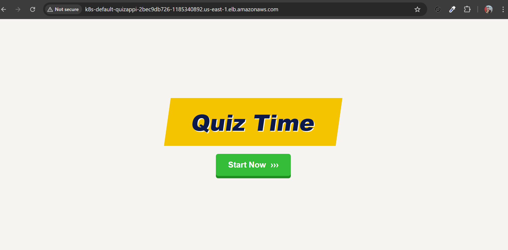
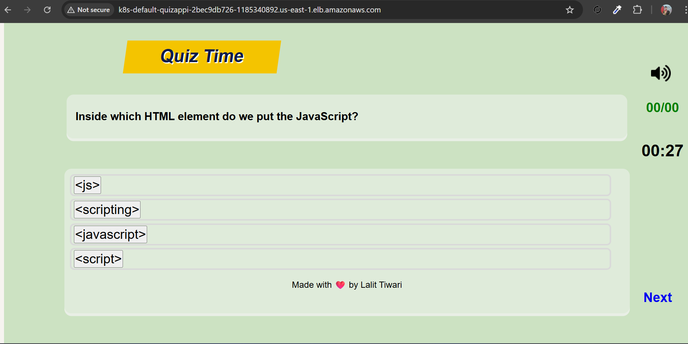

# Quiz App 🧠

An interactive quiz application built using **HTML, CSS, and JavaScript**.  
This app allows users to answer multiple-choice questions with a **timer**, tracks their score, and displays a **result screen with a progress bar**.

---

## Features

- Multiple-choice questions with correct/wrong feedback  
- Timer for each question  
- Score tracking across all questions  
- Sound effects for correct and incorrect answers  
- Result screen with a green/red progress bar  
- Retry button to restart the quiz  

---


## Screenshots

### First Page


### Result Page



---

# 🚀 Quiz App Deployment on AWS EKS with ALB

## 📌 Project Overview

Today we successfully deployed the **Quiz App** to an AWS EKS cluster using:

- Amazon EKS (Kubernetes)
- AWS Load Balancer Controller
- Application Load Balancer (ALB)
- IAM Roles for Service Accounts (IRSA)
- Docker (for containerization)
---

# 🏗️ Architecture

User → ALB (Internet Facing) → Kubernetes Ingress → Service → Pods → Quiz App

---

# ⚙️ Step-by-Step Deployment Process

## 1️⃣ Prerequisites

- AWS CLI configured
- kubectl installed
- eksctl installed
- Docker installed
- AWS account with proper permissions

---

## 2️⃣ Create EKS Cluster
Using eksctl (Production Ready with managed node group):

```bash
eksctl create cluster \
  --name quiz-cluster \
  --region us-east-1 \
  --nodegroup-name quiz-nodes \
  --node-type t3.medium \
  --nodes 2 \
  --nodes-min 2 \
  --nodes-max 4 \
  --managed

  Verify:
  kubectl get nodes

This creates:

VPC

Subnets

Security Groups

EKS Control Plane

Worker Nodes

IAM Roles

🚀 STEP 3: Build & Push Docker Image to ECR
1️⃣ Create ECR Repo
aws ecr create-repository --repository-name quiz-app

2️⃣ Login to ECR
aws ecr get-login-password --region ap-south-1 | \
docker login --username AWS --password-stdin <ACCOUNT_ID>.dkr.ecr.ap-south-1.amazonaws.com

3️⃣ Build Image
docker build -t quiz-app .

4️⃣ Tag Image
docker tag quiz-app:latest <ACCOUNT_ID>.dkr.ecr.ap-south-1.amazonaws.com/quiz-app:latest

5️⃣ Push Image
docker push <ACCOUNT_ID>.dkr.ecr.ap-south-1.amazonaws.com/quiz-app:latest

🚀 STEP 4: Kubernetes Deployment YAML (Production-Level)
📁 deployment.yaml inside k8s folder.

kubectl apply -f deployment.yml

5️⃣ Create Service (inside k8s folder.)
kubectl apply -f service.yml

6️⃣ Create IAM Policy

Download official policy:
curl -O https://raw.githubusercontent.com/kubernetes-sigs/aws-load-balancer-controller/main/docs/install/iam_policy.json

Step 2 — Verify It Contains Required Permission
cat iam_policy.json | grep DescribeListenerAttributes


Create policy:
aws iam create-policy \
  --policy-name AWSLoadBalancerControllerIAMPolicy \
  --policy-document file://iam_policy.json

OIDC Attached:
  eksctl utils associate-iam-oidc-provider \
  --region us-east-1 \
  --cluster quiz-cluster \
  --approve

Verify OIDC is Attached:
  aws iam list-open-id-connect-providers


STEP 4: Create IAM Service Account (IRSA)
eksctl create iamserviceaccount \
  --cluster quiz-cluster \
  --namespace kube-system \
  --name aws-load-balancer-controller \
  --attach-policy-arn arn:aws:iam::<account-id>:policy/AWSLoadBalancerControllerIAMPolicy \
  --approve


8️⃣ Install AWS Load Balancer Controller

Using Helm:

helm repo add eks https://aws.github.io/eks-charts
helm repo update

helm install aws-load-balancer-controller eks/aws-load-balancer-controller \
  -n kube-system \
  --set clusterName=quiz-cluster \
  --set serviceAccount.create=false \
  --set serviceAccount.name=aws-load-balancer-controller

Verify:
kubectl get pods -n kube-system

🌍 Create Ingress (ALB)
9️⃣ Ingress YAML (inside k8s folder)

kubectl apply -f ingress.yml
kubectl apply -f hpa.yml

✅ Verify Deployment
kubectl get ingress
kubectl get hpa

Output:
k8s-default-quizappi-xxxx.elb.amazonaws.com

🌐 Access Application

Open in browser:
http://k8s-default-quizappi-xxxx.elb.amazonaws.com


🛠️ Issues Faced & Resolved
❌ ALB Not Creating (AccessDenied Error)

Error:
elasticloadbalancing:DescribeListenerAttributes not authorized

✅ Fix

Attached latest IAM policy to Load Balancer Controller role.

Restarted controller:
kubectl rollout restart deployment aws-load-balancer-controller -n kube-system


🔥 PART 2 — IAM TROUBLESHOOTING CHEAT SHEET
🧠 Step 1 — Confirm Account
aws sts get-caller-identity

🧠 Step 2 — Confirm Role Used By Pod
kubectl get sa aws-load-balancer-controller -n kube-system -o yaml

🧠 Step 3 — Confirm Role Exists
aws iam get-role --role-name <role-name>

🧠 Step 4 — Check Attached Policies
aws iam list-attached-role-policies --role-name <role-name>

🧠 Step 5 — Check Policy Contains Permission
aws iam get-policy-version \
  --policy-arn <policy-arn> \
  --version-id v1

  🧠 Step 6 — Check Controller Logs
  kubectl logs -n kube-system deployment/aws-load-balancer-controller

  🧠 Step 7 — Check OIDC Provider
  aws iam list-open-id-connect-providers

  If missing:
  eksctl utils associate-iam-oidc-provider \
  --region us-east-1 \
  --cluster quiz-cluster \
  --approve

👨‍💻 Author

Lalit
DevOps Practice Deployment – EKS + ALB

